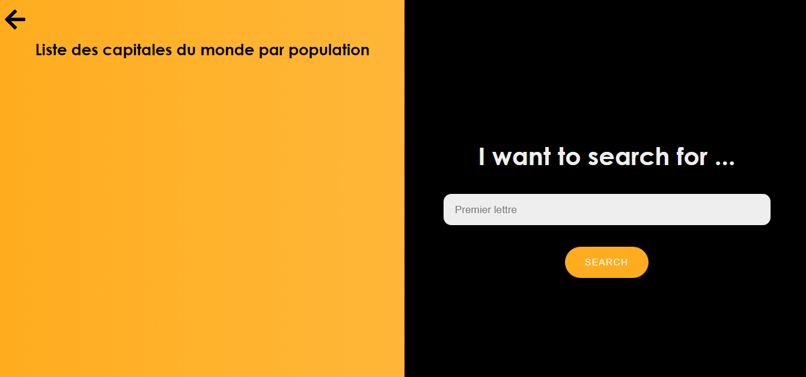

# projetPhp
L'objectif de ce projet  est de créer un script PHP qui permet d'ajouter le capital et la population d'un pays qui est déjà dans la base et de retourner le nombre de pays presents dans la base de données et aussi d'afficher les pays qui commence
par un lettre donnée 

## DEMO
.png)

